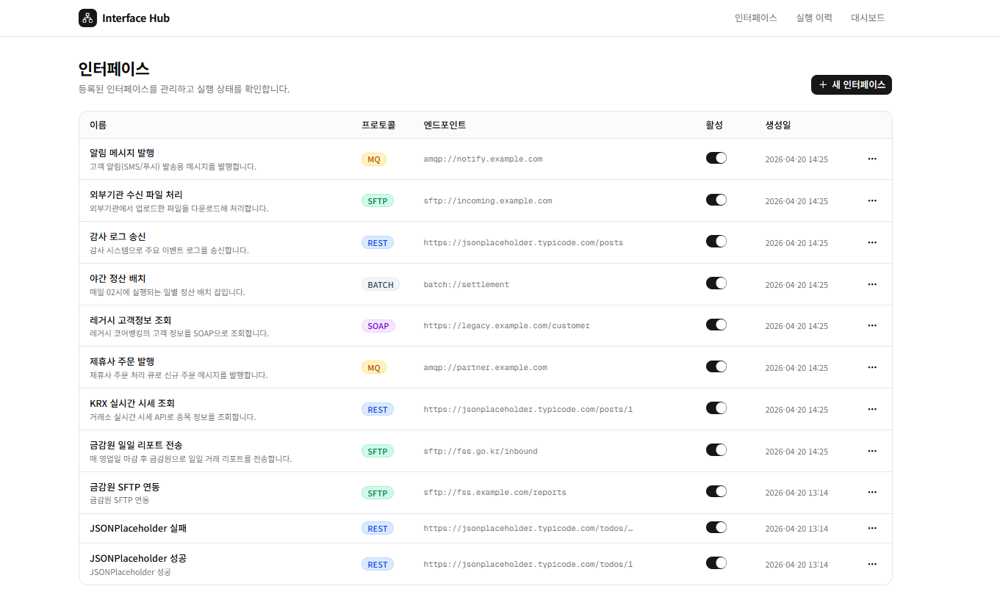
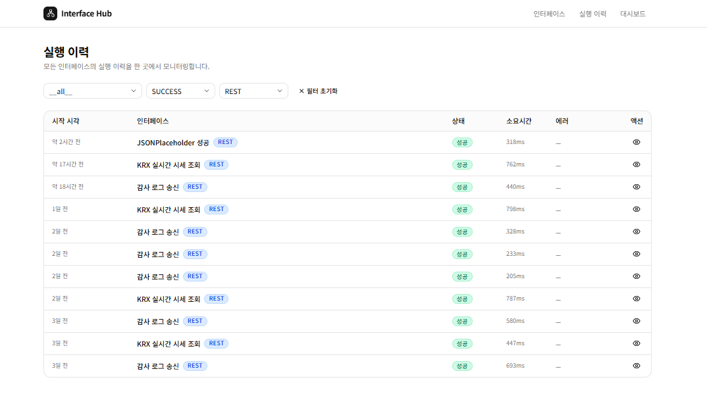
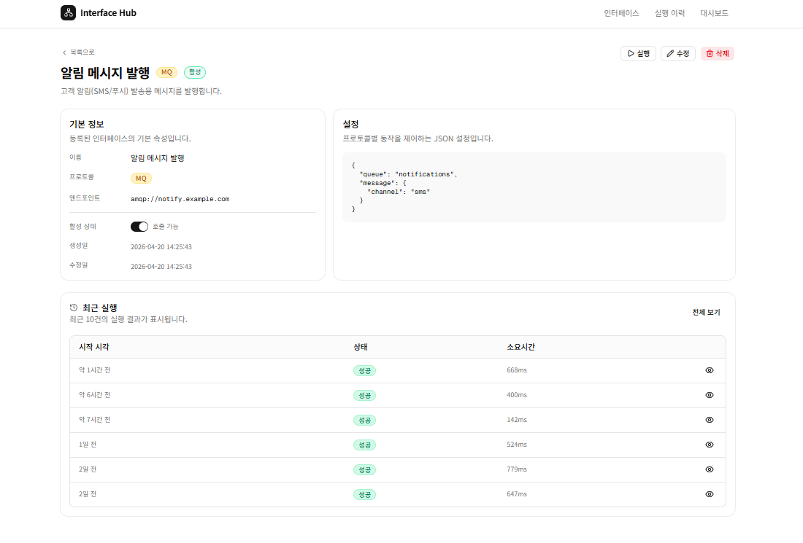
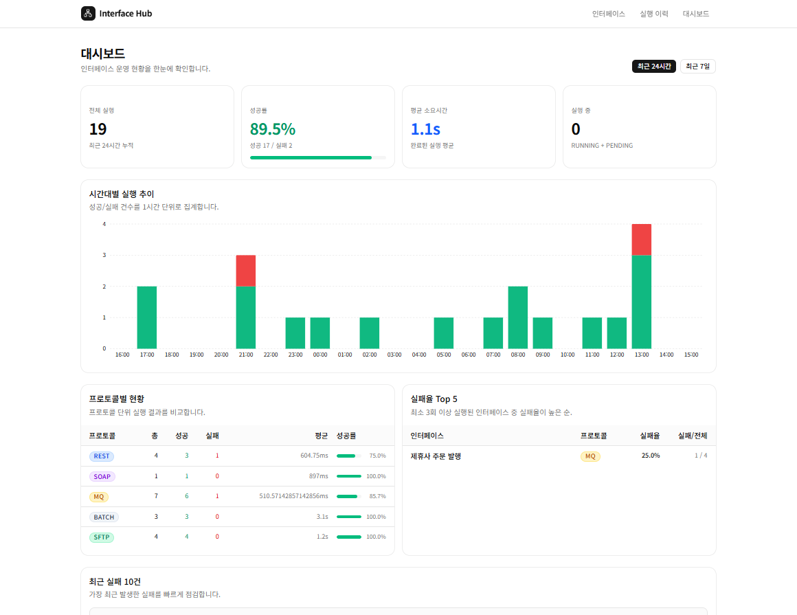

# Interface Hub

금융사의 내부 시스템과 외부 기관을 잇는 다수 인터페이스를 단일 화면에서 관리하는 중앙화 플랫폼.


> 노아에이티에스 2025년 상반기 연구소 인력 채용 포트폴리오 · 개발 기간 1일 · 바이브코딩(Claude Code 기반)

## 라이브 데모

- 데모: https://interface-hub.vercel.app
- 저장소: https://github.com/dbwls99706/interface-hub


*등록된 인터페이스를 프로토콜과 활성 상태별로 한눈에 확인하고 CRUD를 수행한다.*


*인터페이스/상태/프로토콜 필터와 더 보기 기반 페이지네이션, 진행 중 실행은 3초 폴링.*


*요청, 응답, 단계별 로그를 탭으로 분리해 디버깅 흐름을 단축한다.*


*최근 24시간/7일 KPI, 시계열 추이, 프로토콜별 현황, 실패율 Top 5, 최근 실패를 한 화면에 집계.*

## 문제 정의와 해결

금융사는 내부 핵심 시스템과 외부 기관(금감원, 제휴사 등) 사이에서 수십 개의 인터페이스를 REST, SOAP, MQ, Batch, SFTP/FTP 등 서로 다른 프로토콜로 운영한다. 프로토콜마다 도구와 콘솔이 흩어져 있으면 등록, 실행, 모니터링, 재처리, 로그 추적이 모두 따로 돌고 운영 복잡도가 폭증한다.

Interface Hub는 이 모든 인터페이스를 단일 화면에서 등록하고 실행하고 모니터링하고 재처리하는 중앙화 플랫폼이다. MVP 범위에서는 REST를 실제로 호출하고 나머지 4종은 동일 시그니처의 Mock Adapter로 구현해, 운영 화면과 확장 구조를 함께 검증한다.

## 핵심 기능

- 5가지 프로토콜 통합 관리 (REST 실동작 호출 + SOAP/MQ/BATCH/SFTP Mock Adapter)
- 실행 이력 추적과 실시간 폴링 (RUNNING/PENDING이 있을 때만 3초 SWR 폴링, 그 외 비활성)
- 프로토콜별 Adapter 패턴 (확장 시 어댑터 파일 1개 + registry 1줄 추가로 끝)
- 분석 대시보드 (KPI 카드, 시계열 BarChart, 프로토콜 브레이크다운, 실패율 Top 5, 최근 실패)
- 실패한 실행을 1클릭으로 재처리 (원본 실행 보존, 새 Execution을 retryOf로 연결)
- 로컬 SQLite와 프로덕션 Turso libSQL을 코드 변경 없이 환경변수로 전환

## 기술 스택

| 영역 | 기술 | 선택 이유 |
| --- | --- | --- |
| 프레임워크 | Next.js 16 App Router, React 19 | Server Component와 Server Action으로 API Route를 줄이고 데이터 흐름을 단일화 |
| 언어 | TypeScript strict, Zod | any 금지 정책과 입력 검증을 컴파일/런타임 두 층에서 보장 |
| UI | Tailwind CSS, shadcn/ui (Base UI), Recharts | 디자인 시스템 일관성과 차트 표현력 확보 |
| 폼 | react-hook-form + zodResolver | 비제어 컴포넌트 성능과 스키마 단일 출처 |
| 데이터 페칭 | SWR (useSWR + useSWRInfinite) | 조건부 폴링과 더 보기 페이지네이션을 동일 API로 처리 |
| ORM | Prisma 7 | 모델 정의와 마이그레이션, 타입 안전 쿼리를 단일 도구로 |
| DB | SQLite(로컬), Turso libSQL(프로덕션) | libSQL driver adapter로 동일 코드, 동일 스키마 유지 |
| 배포 | Vercel | App Router와 Server Action 친화, 무중단 배포와 프리뷰 환경 |

## 아키텍처 개요

```
Browser
  │  fetch / form submit
  ▼
Next.js (Server Component, Server Action)
  │  prisma.* 호출
  ▼
Prisma Client (PrismaLibSql adapter)
  │
  ├─ 로컬: file:./dev.db (SQLite)
  └─ 프로덕션: libsql://...turso.io (Turso)
```

실행 흐름

```
ExecuteInterface (Server Action)
  └─ prisma.execution.create (PENDING)
        └─ runExecution()
              ├─ status = RUNNING
              ├─ adapter = getAdapter(protocol)
              ├─ adapter.validateConfig(config)
              ├─ adapter.execute({ endpoint, config, signal })
              │     ├─ AbortController + 30s timeout
              │     └─ AdapterResult { status, request, response, logs[] }
              ├─ prisma.execution.update (status, duration, request, response)
              └─ prisma.executionLog.createMany
```

## 확장 로드맵

- 인증과 권한 (Row Level Security, 조직 단위 데이터 분리)
- 실제 SOAP/MQ/SFTP 클라이언트 어댑터 (현재 Mock Adapter를 실 클라이언트로 교체)
- 스케줄링 (cron 트리거로 인터페이스 자동 실행)
- 알림 연동 (Slack, 이메일로 FAILED 즉시 통보)
- 실행 로그 영구 보관소(S3) 연동과 보존 정책

## 개발 프로세스

### Claude Code와 함께한 1일 MVP

이 프로젝트는 Claude Code를 페어 프로그래밍 파트너로 두고 1일 안에 MVP를 완성하는 것을 목표로 했다. 작업은 Phase 0부터 Phase 8까지 단계별로 쪼개고 각 Phase의 범위, 산출물, 검증 기준을 먼저 글로 정의한 뒤 구현으로 들어갔다.

| Phase | 범위 | 핵심 결과물 |
| --- | --- | --- |
| 0 | 프로젝트 부트스트랩 | Next.js 16 + Tailwind + shadcn 초기화 |
| 1 | DB 스키마와 Prisma 셋업 | Interface, Execution, ExecutionLog 모델 |
| 2 | 인터페이스 CRUD | 목록/생성/수정/삭제 + Zod 검증 |
| 3 | Adapter 레이어와 실행 엔진 | rest.ts 실동작, mock 4종, registry, 30초 타임아웃 |
| 4 | 실행 이력 페이지와 실시간 폴링 | SWR 조건부 폴링, 탭형 상세, Retry |
| 5 | 시드 데이터와 페이지네이션 | seed.ts, useSWRInfinite 더 보기 |
| 6 | 분석 대시보드 | KPI, BarChart, 프로토콜/실패율 분석 |
| 7 | Vercel 배포 준비 | Turso 연동, prisma generate 훅, serverExternalPackages |
| 8 | 포트폴리오 README | 본 문서 |

각 Phase는 다음 루프를 빠르게 반복했다.

1. 요구 정의: 데이터 모델, 사용자 시나리오, 화면 구성을 먼저 글로 정의
2. 프롬프트: 산출물 명세(타입, 인터페이스, 폴더 구조)를 구체적으로 지시
3. 생성: Claude Code가 파일을 생성/수정
4. 검증: TypeScript strict + `npx tsc --noEmit` + 실제 화면 동작 점검
5. 커밋: Conventional Commits 규칙으로 단일 논리 단위 커밋

핵심 통찰 3가지.

- "요구 정의 → 프롬프트 → 생성 → 검증 → 커밋" 루프를 작게 자르는 것이 속도와 품질을 동시에 잡는다.
- AI에게 막연히 "만들어줘"라고 하지 않고, 타입 시그니처와 폴더 구조와 검증 기준을 먼저 못박는 프롬프트가 결과물 품질을 결정한다.
- AI가 만든 코드는 반드시 컴파일러와 실동작으로 검증한다. 매 Phase 끝에 `tsc --noEmit` 0과 화면 회귀 점검을 통과해야 다음 Phase로 넘어간다.

## 로컬 실행 방법

```bash
git clone https://github.com/dbwls99706/interface-hub.git
cd interface-hub
npm install
npx prisma migrate dev
npx prisma db seed
npm run dev
```

브라우저에서 http://localhost:3000 접속.

`.env.local`에 `DATABASE_URL="file:./dev.db"`만 있으면 동작한다.

## 프로덕션 배포 방법

1. Turso 데이터베이스 생성: `turso db create interface-hub`
2. 인증 토큰 발급: `turso db tokens create interface-hub`
3. 마이그레이션 적용: `DATABASE_URL='libsql://...?authToken=...' npm run db:deploy`
4. 시드 적용(선택): `DATABASE_URL='libsql://...?authToken=...' npm run db:seed:remote`
5. Vercel 프로젝트 import 후 환경변수 등록
   - `TURSO_DATABASE_URL` = `libsql://...turso.io`
   - `TURSO_AUTH_TOKEN` = `eyJ...`
6. Deploy 클릭

## 프로젝트 구조

```
app/                      Next.js App Router 페이지
  interfaces/             인터페이스 CRUD
  executions/             실행 이력 + 상세
  dashboard/              분석 대시보드
components/               UI 컴포넌트 (shadcn/ui 기반)
  interfaces/             인터페이스 도메인 컴포넌트
  executions/             실행 이력 도메인 컴포넌트
  dashboard/              대시보드 차트와 카드
lib/
  adapters/               프로토콜 Adapter 레이어 (rest, soap, mq, batch, sftp, registry)
  actions/                Server Actions (인터페이스 CRUD, 실행 엔진, 대시보드 쿼리)
  schemas/                Zod 스키마
  types/                  공용 타입과 JSON 헬퍼
prisma/                   스키마, 마이그레이션, 시드
scripts/                  Turso 배포/리셋 스크립트
docs/screenshots/         README용 스크린샷
```
